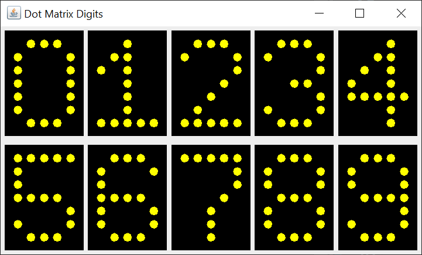

# Java Swing Dot-Matrix Digits

## Introduction

If you’re not familiar with Java Swing, Oracle has an excellent tutorial to get you started, [Creating a GUI With JFC/Swing](https://docs.oracle.com/javase/tutorial/uiswing/index.html). Skip the Netbeans section.

Here's a GUI I created that displays a set of 5x7 dot-matrix digits, from 0 - 9.

## Explanation

You have to code the position of each dot in each digit.

However, you can do this in a flexible way.

Here's what I mean. A 5 x 7 dot matrix digit can be represented as a two-dimensional int array. It could also be represented as a boolean array, but a matrix of 0 and 1 values is easier to visually verify.

As an example. here's a method to code the zero digit. You can see that the ones create a visual outline that can be easily verified.

    private int[][] defineZeroMatrix() {
        int[][] matrix = new int[7][];
        matrix[0] = new int[] { 0, 1, 1, 1, 0 };
        matrix[1] = new int[] { 1, 0, 0, 0, 1 };
        matrix[2] = new int[] { 1, 0, 0, 0, 1 };
        matrix[3] = new int[] { 1, 0, 0, 0, 1 };
        matrix[4] = new int[] { 1, 0, 0, 0, 1 };
        matrix[5] = new int[] { 1, 0, 0, 0, 1 };
        matrix[6] = new int[] { 0, 1, 1, 1, 0 };
        
        return matrix;
    }

It took me about 15 minutes to code all of the dot matrix digit matrices.

It's possible to code a dot matrix digit using a sparse matrix. Unfortunately, that idea leads to more code that's visually harder to verify.

Here's an example of the dot matrix digit two coded as a sparse matrix of coordinates.

    private Point[] defineTwoCoordinates() {
        Point[] array = new Point[14];
        array[0] = new Point(0, 1);
        array[1] = new Point(1, 0);
        array[2] = new Point(2, 0);
        array[3] = new Point(3, 0);
        array[4] = new Point(4, 1);
        array[5] = new Point(4, 2);
        array[6] = new Point(3, 3);
        array[7] = new Point(2, 4);
        array[8] = new Point(1, 5);
        array[9] = new Point(0, 6);
        array[10] = new Point(1, 6);
        array[11] = new Point(2, 6);
        array[12] = new Point(3, 6);
        array[13] = new Point(4, 6);
        
        return array;
    }
    
After we've coded all of the digit matrices, we'll create an array of matrices.

    private int[][][] matrices;
    
The leftmost index is the digit, from 0 to 9. The second index is the row of the digit matrix. The third index is the column of the digit matrix.

Finally, we extend a JPanel and override the paintComponent method to actually paint the dot matrix digit.

    @Override
    protected void paintComponent(Graphics g) {
        super.paintComponent(g);
        
        g.setColor(dotColor);
        for (int row = 0; row < matrices[digit].length; row++) {
            for (int column = 0; column < matrices[digit][row].length; column++) {
                if (matrices[digit][row][column] != 0) {
                    int x = margin + column * pixelWidth;
                    int y = margin + row * pixelWidth;
                    g.fillOval(x, y, dotWidth, dotWidth);
                }
            }               
        }
    }
